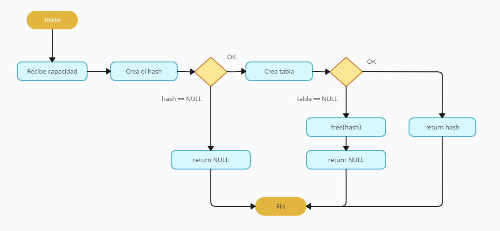
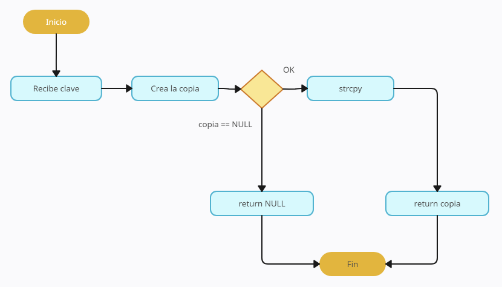
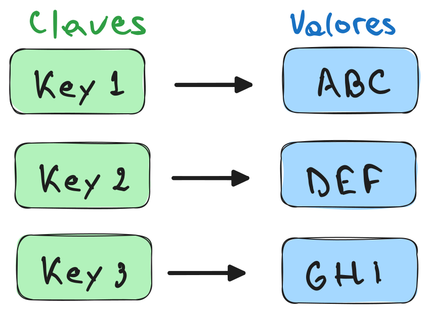
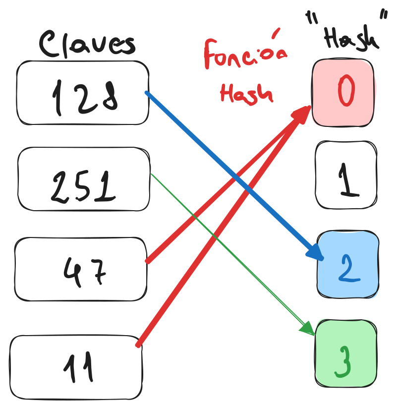

<div align="right">

</div>

# TDA HASH

## Repositorio de Lucas Aldonate - 100030 - laldonate@fi.uba.ar

- Para compilar:

```bash
make pruebas_chanutron
```

- Para ejecutar:

```bash
./pruebas_chanutron
```

- Para ejecutar con valgrind:
```bash
make valgrind-chanutron
```
---
##  Funcionamiento

Se crea un hash, en caso de que no haya errores, se procede a utilizar las distintas funciones de dicho hash.

Es importante destacar, que al tratarse de un hash abierto, a la hora de lidiar con colisiones, estas ultimas se van encadenando una detrás de la otra.

La función de inserción utiliza tres funciones auxiliares `rehash`, `copiar_clave` y `funcion_hash`. La primera se encarga de duplicar el tamaño del hash en caso de que la division flotante entre la cantidad de elementos y la capacidad del hash supere al factor de carga máximo, la segunda copia la clave que el usuario pasa por parámetro a la hora de insertar una clave y la última se encarga de decidir en que lugar del hash debe posicionarse el elemento a insertar y transforma las claves en números asociados.

A continuación, un diagrama de la creación del hash y de la copia de claves para entender un poco más del funcionamiento del hash:

`hash_crear`
<div align="center">

</div>

`copiar_clave`
<div align="center">

</div>

---

## Respuestas a las preguntas teóricas

### Respuesta 1

Un diccionario es una estructura de datos que se utiliza para almacenar y organizar información. Su eje principal se basa en alamacenar pares clave-valor, dónde las claves son únicas y se utilizan para que el usuario pueda acceder a su valor correspondiente.

<div align="center">

</div>

### Respuesta 2

Una función hash es una función que transforma claves en un número asociado. <div align="center">

</div>

Sus caracteristicas principales son la eficiencia que posee a la hora de insertar elementos en una tabla de hash, su irreversibilidad y la resistencia a colisiones que hace referencia a la capacidad de la funcion de evitar o reducir colisiones cuando dos entradas diferentes producen el mismo valor de hash.

### Respuesta 3

Un tabla hash es una estructura que contiene valores, los cuales se pueden hallar a partir de una clave (prácticamente como el diccionario). Posee diversas caracteristicas:
- Colisiones: puede suceder que haya más claves que espacios en la tabla de hash. Claves distintas dan el mismo valor de "hash".
- Factor de carga: Indica el grado de ocupación de la tabla de hash (y que tan probable es que haya colisión, varía entre 0 y 1)
- Rehash: es la función que se encargar de agrandar la tabla de hash cuando la cantidad de elmentos sobre la capacidad del hash supera al factor de carga.

En cuanto a los tipos de resolución de colisiones, el encadenamiento que es el que se utilizó en este TP, encadena los pares que colisionan en un mismo hash a través de nodos enlazados. 

El probing, tiene varias versiones, las mas importantes son Linear Probing, que a la hora de encontrarse con una colisión, se busca la siguiente ubicación disponible en la tabla de manera lineal, es decir, una posición a la vez. Y el Quadratic Probing, que realiza en este caso la busqueda con una función cuadrática.

Por último la zona de desborde, utiliza una estructura adicional que almacena los elementos que colisionan en una misma posición de la tabla.

